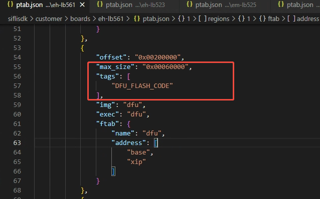
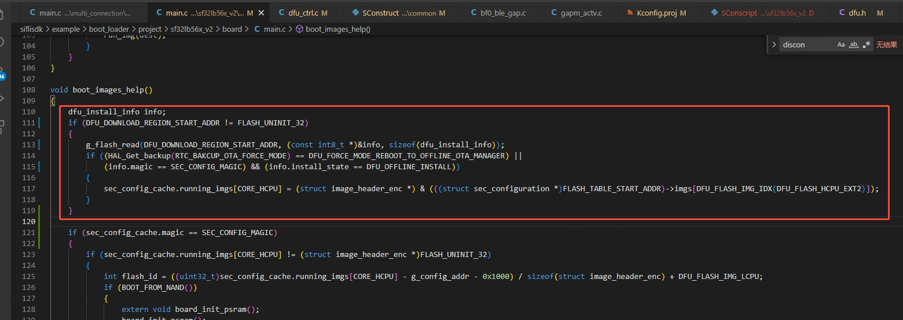
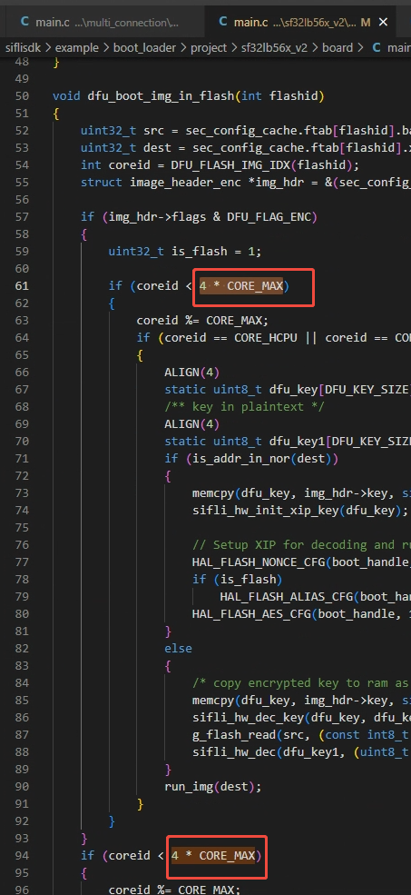
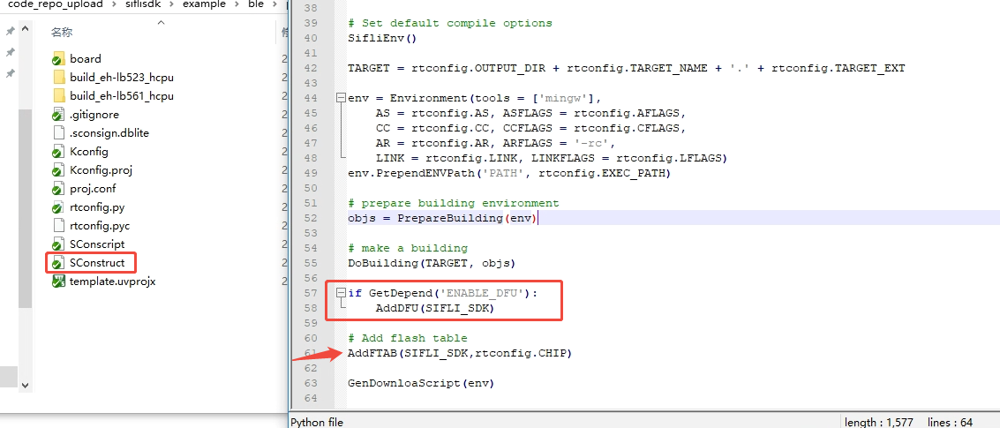
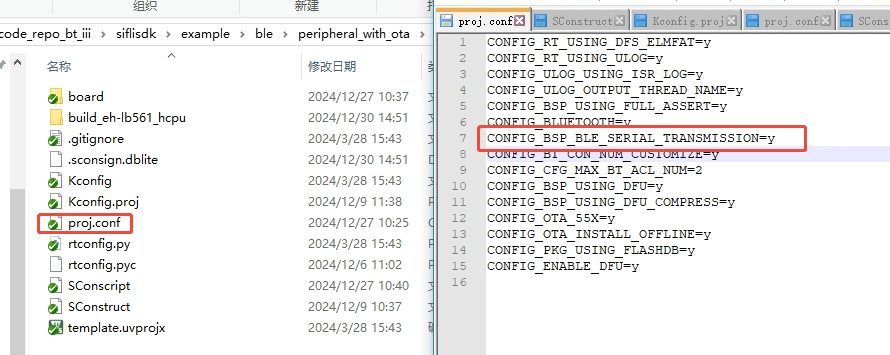
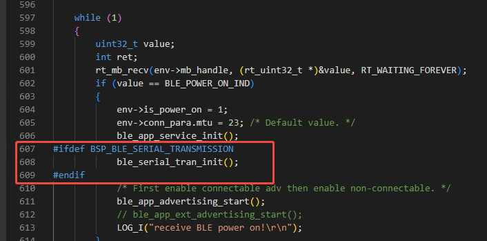
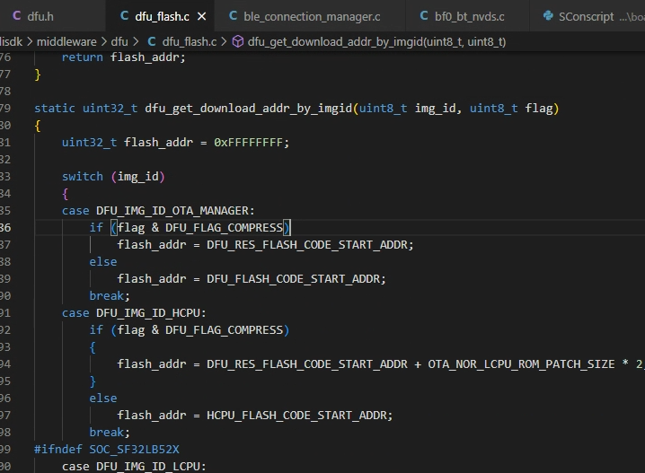
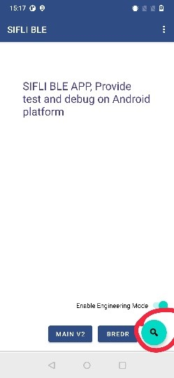
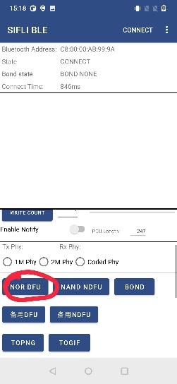
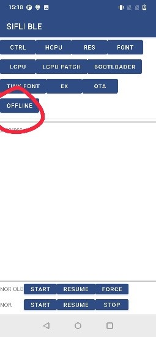

# peripheral_with_ota example说明和SDK DFU接入

## 支持的平台
52x和56x的nor flash芯片

## 概述
<!-- 例程简介 -->
本例程演示了基于BLE peripheral工程作为主工程，添加DFU功能。
1.	升级的最小单元是工程编译生成的.bin文件，事先将需要升级的文件，可以升级一个文件，也可以升级多个文件，通过特定脚本，压缩制作成一个升级包。
2.	可以使用sifli提供的手机APP或者接入手机SDK，在系统的主工程（后面也称作hcpu.bin）进行下载，传输升级包到系统的升级备份区间，也可以选择自行传输，然后调用安装接口。
3.	调用安装接口后，系统首先会检查升级包中是否包含dfu.bin，如果包含，则先更新dfu.bin。
4.	更新完dfu.bin或者不包含dfu.bin时，系统会重启然后运行dfu.bin的内容。
5.	在dfu.bin中，会把升级包中除了dfu.bin的所有bin，都解压安装到对应区域，安装完成后会再次重启，重启后进入hcpu.bin，升级完成

## 例程的使用
1. 本例程的主工程同BLE peripheral，该工程的时候方法可以参照example/ble/peripheral工程
2. 制作升级包的工具ezip.exe，img_toolv37.exe在tool/secureboot目录下，key相关内容在tool/secureboot/sifli02目录下，把以上文件放在同一目录然后按照下文制作升级包部分，制作升级包。
3. 将升级包通过BLE APP下载，或者uart/jlink下载DFU_DOWNLOAD_REGION区域。
4. 如果使用sifli ble app下载，将自动安装重启，如果是自行下载，需要调用dfu_offline_install_set_v2，然后调用HAL_PMU_ReBoot进行重启
5. 重启后将运行升级包重的主程序。

### menuconfig配置
见接入方法-主工程

### 编译和烧录
切换到例程project/common目录，运行scons命令执行编译：
```c
> scons --board=eh-lb561 -j8
```
切换到例程`project/common/build_xx`目录，运行`uart_download.bat`，按提示选择端口即可进行下载：
```c
$ ./uart_download.bat

     Uart Download

please input the serial port num:5
```
关于编译、下载的详细步骤，请参考[快速入门](/quickstart/get-started-gcc.md)的相关介绍。

## 接入方法
本工程已经配置完毕如下内容，如果需要在自己的工程接入DFU sub project，需要按如下进行检查
### ptab.json
需要配置DFU_FLASH_CODE和DFU_DOWNLOAD_REGION区域。
DFU_FLASH_CODE是dfu.bin的区域，size推荐大小384KB
DFU_DOWNLOAD_REGION是存放下载文件的空间，需要预留一次升级所有文件大小 * 0.7的空间


 
### Boot loader
检查对应使用的boot loader的main.c有无以下选择running_imgs[CORE_HCPU]的逻辑，没有需要手动添加

 

同时main.c的void dfu_boot_img_in_flash（int flashid）中两个2 * CODE_MAX判断，需要改为4 * CORE_MAX



### 主工程
Kconfig.proj
增加DFU开关

 

proj.conf
打开DFU相关的代码和DFU开关

 

Sconstruct
添加DFU子工程
注：需要添加到AddFTAB之前

 
### DFU工程
通常无需修改

## 传输
如果自行传输，需要将打包文件下载到DFU_DOWNLOAD_REGION

如果要使用sifli提供的手机传输lib来传输该升级包
需要在主工程打开如下选项


代码中添加如下内容




## 制作升级包
.\imgtoolv37.exe gen_dfu --img_para app 16 0 dfu 16 6 --key=s01 --sigkey=sig --dfu_id=1 --hw_ver=51 --sdk_ver=7001 --fw_ver=1001001 --com_type=0 --offline_img=2

所有文件和待制作的升级文件，放到同一目录
同时制作hcpu和dfu的命令如上，hcpu代表制作hcpu.bin，dfu代表制作dfu.bin
Bin名字后面的第一个参数用于压缩，16是使用压缩，0是不压缩
Bin名字后面的第二个参数表示image id，hcpu是0，dfu 是6。

制作文件的数量，可以任意调整，可以只升级HCPU，也可以同时制作多个bin，如果制作了dfu.bin，升级前就会更新Dfu安装程序

制作完成后只需要传输offline_install.bin

如果需要升级HCPU和DFU以外的bin，需要自行指定image id对应的flash地址，在dfu_flash.c的dfu_get_download_addr_by_id中，添加新的ID，然后返回ptab.c中定义的地址即可，flag&DFU_FLAG_COMPRESS条件下的地址不需要实现。

 
## 手机使用
操作如下图示意，搜索板子的BLE广播，点击对应设备，然后选择nor dfu，最后选择offline，不需要再点击下方的start等按钮




## 异常诊断
1.	编译时DFU工程提示空间不足
board.conf中打开的内容，dfu工程也会编译，导致dfu工程编译一些不需要的东西，大小也可能超过ptab.json中DFU_FLASH_CODE的大小。
对于borad.conf中定义的不需要编译到dfu工程的内容，修改dfu工程下的proj.conf，定义对应项为n

 

2.	DFU_DOWNLOAD_REGION大小相关
注：图片资源是已经压缩过的，所以DFU脚本几乎不能对其进行压缩，所以要按 * 1.0计算
例如设计最大升级为同时升级hcpu.bin + res.bin + dfu.bin，其中res.bin为图片资源
那么就需要预留最大hcpu.bin size * 0.7+ res.bin size + dfu.bin size * 0.7的空间


## 参考文档
<!-- 对于rt_device的示例，rt-thread官网文档提供的较详细说明，可以在这里添加网页链接，例如，参考RT-Thread的[RTC文档](https://www.rt-thread.org/document/site/#/rt-thread-version/rt-thread-standard/programming-manual/device/rtc/rtc) -->

## 更新记录
|版本 |日期   |发布说明 |
|:---|:---|:---|
|0.0.1 |01/2025 |初始版本 |
| | | |
| | | |
