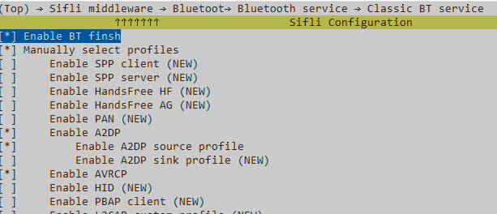
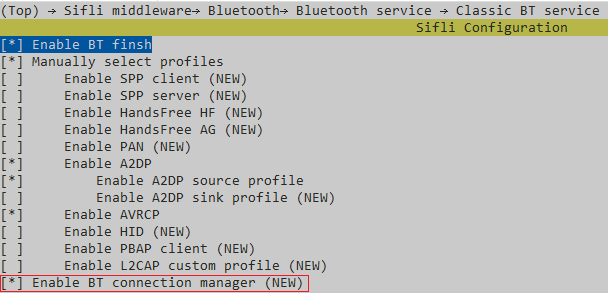

# BT music source示例

源码路径：example/bt/music_source

{#Platform_music_src}
## 支持的平台
<!-- 支持哪些板子和芯片平台 -->
+ eh-lb525
+ eh-lb563
+ eh-lb567
+ eh-lb58x

## 概述
<!-- 例程简介 -->
本例程演示本地音乐播放以及连接耳机等A2DP SINK设备后将声音送给对端设备，包含：
+ 预置一首mp3音频文件在root分区。


## 例程的使用
<!-- 说明如何使用例程，比如连接哪些硬件管脚观察波形，编译和烧写可以引用相关文档。
对于rt_device的例程，还需要把本例程用到的配置开关列出来，比如PWM例程用到了PWM1，需要在onchip菜单里使能PWM1 -->
例程开机会默认使能蓝牙，并通过FINSH命令进行控制
1. 播放本地音乐：
通过命令music play_default来播放预置的.mp3文件，如果没有连接耳机等蓝牙设备，会直接从喇叭播出。
如果想播放文件系统内的歌曲可以使用music play [loop_time] [path]来进行，例music play 3 \A.mp3会播放root分区下A.mp3 3次

2. 搜索蓝牙设备
通过命令music inquiry start来搜索耳机类蓝牙设备，该命令只会上报搜到的COD的Major Class为0x000400的设备(Audio device)。
搜索到的设备会以log “device [%s] searched”和“device COD is [%d], addr is xx:xx:xx:xx:xx:xx”的形式打印。

3. 连接蓝牙设备
通过命令music conn [addr]来进行连接，addr将上面搜到设备的地址（xx:xx:xx:xx:xx:xx）打印值复制即可。
如果已知晓耳机类蓝牙设备地址，可以不用进行搜索蓝牙设备，直接连接即可。
当A2DP profile连上以后，本设备的输出音源会自动从喇叭切到耳机端，断开后会切回来。

4. 调节对端蓝牙设备音量
通过命令music set_vol [val]来实现，val在0-127之间有效。本例程目前只支持调节支持绝对音量功能的耳机，若耳机不支持该功能，则无法调节音量。


### 硬件需求
运行该例程前，需要准备：
+ 一块本例程支持的开发板（[支持的平台](#Platform_music_src)）。
+ 喇叭。

### menuconfig配置

1. 本例程需要读写文件，所以需要用到文件系统，配置`FAT`文件系统：


     ```{tip}
     mnt_init 中mount root分区。
     ```
2. 使能AUDIO CODEC 和 AUDIO PROC：

3. 使能AUDIO(`AUDIO`)：

4. 使能AUDIO MANAGER.(`AUDIO_USING_MANAGER`)

5. (`AUDIO_LOCAL_MUSIC`)

6. 预置音频文件，放到如下\disk\目录下即可预置下载：  
* 音频文件在music_source/disk/test.mp3
7. 使能蓝牙(`BLUETOOTH`)：

8. 使能A2DP source和AVRCP：

6. 使能BT connection manager：

7. 使能NVDS


### 编译和烧录
切换到例程project目录，运行scons命令执行编译：
```c
> scons --board=eh-lb525 -j32
```
切换到例程`project/build_xx`目录，运行`uart_download.bat`，按提示选择端口即可进行下载：
```c
$ ./uart_download.bat

     Uart Download

please input the serial port num:5
```
关于编译、下载的详细步骤，请参考[快速入门](/quickstart/get-started-gcc.md)的相关介绍。

## 例程的预期结果
<!-- 说明例程运行结果，比如哪几个灯会亮，会打印哪些log，以便用户判断例程是否正常运行，运行结果可以结合代码分步骤说明 -->
例程启动后：
1. 在不连接蓝牙的情况播放内置音乐
2. 可以搜索耳机类蓝牙设备，并在连接后播放内置音乐

## 异常诊断


## 参考文档
<!-- 对于rt_device的示例，rt-thread官网文档提供的较详细说明，可以在这里添加网页链接，例如，参考RT-Thread的[RTC文档](https://www.rt-thread.org/document/site/#/rt-thread-version/rt-thread-standard/programming-manual/device/rtc/rtc) -->

## 更新记录
|版本 |日期   |发布说明 |
|:---|:---|:---|
|0.0.1 |01/2025 |初始版本 |
| | | |
| | | |
